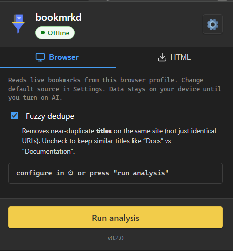
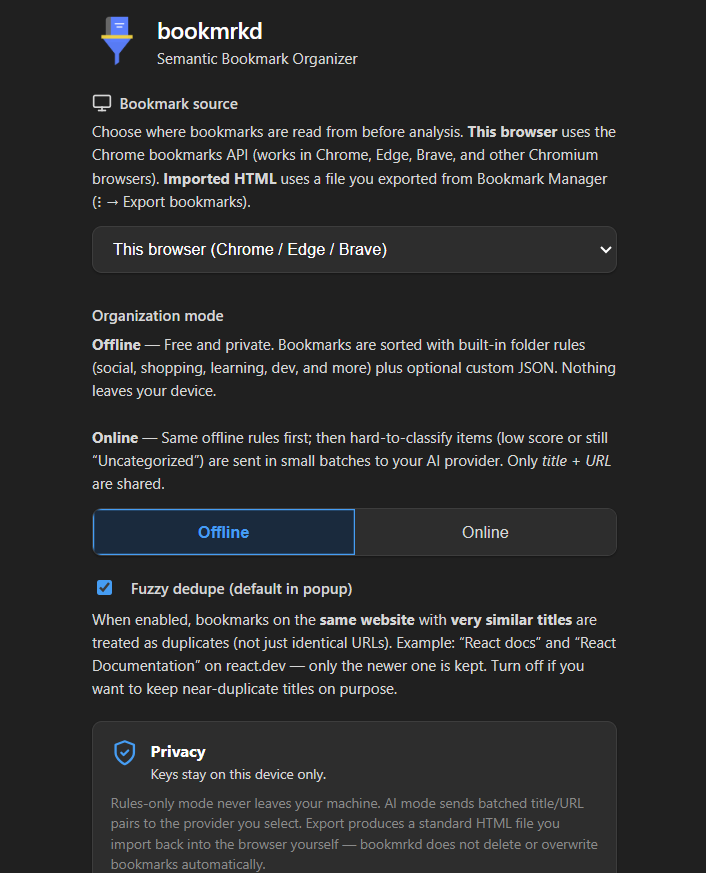
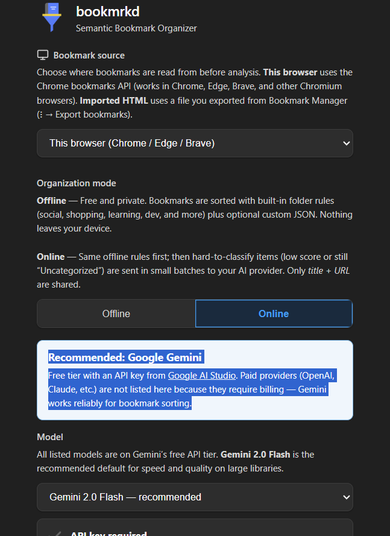

# bookmrkd

<p align="center">
  
</p>

<p align="center">
  <strong>Semantic Bookmark Organizer</strong><br />
  Dedupe, categorize, and export bookmarks — offline-first, optional Gemini AI.
</p>

<p align="center">
  <a href="https://github.com/minhaj14d/bookmrkd/blob/main/LICENSE"></a>
  <a href="https://github.com/minhaj14d/bookmrkd/releases"></a>
  
</p>

<p align="center">
  <strong>Minhajul Abedin</strong> · <a href="https://github.com/minhaj14d">github.com/minhaj14d</a>
</p>

---

## Overview

**bookmrkd** is a Chrome extension that cleans large bookmark libraries: exact and fuzzy dedupe, automatic folder categorization (social, work, learning, dev, shopping, and more), relevance scoring, and Netscape HTML export for re-import. Your live bookmarks are never overwritten — you review the result and import when ready.

| Mode | Behavior |
|------|----------|
| **Offline** | Everything runs on your device. No API key, no network required. |
| **Online** | Same local rules first; optional **Google Gemini** (free API tier) for stubborn links. Only **title + URL** batches are sent. |

## Screenshots

### Popup — analyze & export

Browser or imported HTML, fuzzy dedupe, category breakdown, export and report.

<p align="center">
  
</p>

### Settings — Offline

Built-in folder rules, custom JSON, privacy-first — nothing leaves your machine.

<p align="center">
  
</p>

### Settings — Online (Gemini)

Optional cloud assist with a free [Google AI Studio](https://aistudio.google.com/apikey) key. **Gemini 2.0 Flash** recommended.

<p align="center">
  
</p>

## Features

- Exact + fuzzy URL/title dedupe  
- 22+ built-in rules + custom JSON (merged with built-ins)  
- Legacy host classifier (50+ patterns)  
- Web Worker for 2,500+ bookmarks  
- Export organized HTML + summary report  
- In-extension privacy policy (`extension/privacy.html`)  

## Install

### Clone & load unpacked

```bash
git clone https://github.com/minhaj14d/bookmrkd.git
cd bookmrkd/extension
npm ci
```

Chrome → **Extensions** → **Developer mode** → **Load unpacked** → select the `extension` folder.

### From a GitHub Release

1. Open [Releases](https://github.com/minhaj14d/bookmrkd/releases).  
2. Download `bookmrkd-v1.0.0-extension.zip`, extract, then **Load unpacked** on the extracted folder.

### Pack `.crx` (optional)

1. Open `chrome://extensions` → enable **Developer mode**.  
2. Click **Pack extension** → choose this repo’s `extension` folder.  
3. First time: leave private key empty (Chrome creates `.pem` + `.crx`). **Keep `.pem` secret.**  
4. Later updates: pack again with the same `.pem`.

### Quick start

1. Pin **bookmrkd** → open **Settings** (gear).  
2. Choose **Offline** or **Online** (Gemini API key if Online).  
3. In the popup: **Run analysis** → review categories → **Export HTML**.  
4. Chrome **Bookmark Manager** → ⋮ → **Import bookmarks**.

## Build release ZIP

```bash
cd extension
npm run pack
```

Output: `release/bookmrkd-v1.0.0-extension.zip` (version from `/VERSION`).

## Development

```bash
cd extension
npm run lint
npm run typecheck
npm run version:sync   # after editing ../VERSION
```

## Repository layout

```
bookmrkd/
├── extension/        # Chrome MV3 extension (load this folder)
├── screenshot_*.png  # UI previews (README)
├── VERSION
├── LICENSE           # GPL-3.0
└── README.md
```

## License

Copyright © 2026 [Minhajul Abedin](https://github.com/minhaj14d). Licensed under [GPL-3.0](LICENSE).
