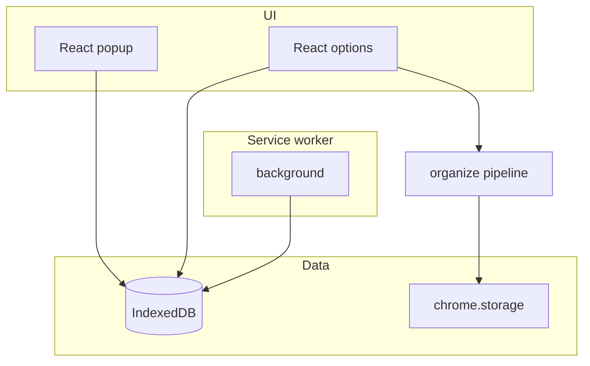

# bookmrkd

<p align="center">
  
</p>

<p align="center">
  <strong>Privacy-first bookmark library</strong><br />
  Save, tag, search — offline by default. Optional bulk organize + Gemini in Advanced.
</p>

<p align="center">
  <a href="https://github.com/minhaj14d/bookmrkd/blob/main/LICENSE"></a>
  <a href="https://github.com/minhaj14d/bookmrkd/releases"></a>
  
</p>

<p align="center">
  <strong>Minhajul Abedin</strong> · <a href="https://github.com/minhaj14d">github.com/minhaj14d</a>
</p>

---

## Problem

Chrome bookmarks are built for saving links, not for **finding** them later. There is no first-class tagging, search across tags, or a local library you control. Bulk “folders” do not fix duplicate tabs, stale “read later” piles, or cross-device capture without sending everything to a cloud service.

## Solution

**bookmrkd** is a Manifest V3 extension that acts as a **local-first bookmark library**:

- Save the current tab with tags (popup or context menu)
- Search and filter by title, URL, tags, and domain (options page)
- Export/import your library as JSON (portable backup)
- **Advanced:** optional bulk dedupe/categorize of Chrome’s bookmark tree + Netscape HTML export (v1.0 flow)
- **No analytics, no telemetry, no data selling** — library data stays in IndexedDB on your device

```text
Popup (save + recents)
        ↓
IndexedDB library  ←→  Options (search / filter / export)
        ↓
Advanced (organize Chrome bookmarks, optional Gemini)
```

## Features

| Area | v1.1.0 |
|------|--------|
| **Library** | Save tab, tags, favicon, URL dedupe, recent list |
| **Search** | Title, URL, tags; filter by tag and domain |
| **Storage** | IndexedDB (`bookmrkd_v1`); settings in `chrome.storage` |
| **Backup** | Export/import JSON |
| **Advanced** | Dedupe, rules, fuzzy match, HTML export, report, Gemini assist |
| **Sync** | Not in v1.1 — planned v1.2 (Supabase, opt-in) |

## Architecture



## Tech stack

- Chrome Extension **Manifest V3**
- **React** + **Vite** + **@crxjs/vite-plugin**
- **IndexedDB** for the library
- **TypeScript** (storage, UI) + legacy **ES modules** (organize pipeline)
- Optional **Google Gemini** (Advanced only)

## Privacy

- **No tracking** — no analytics SDKs, no external logging
- **No data selling** — your library is not uploaded in v1.1.0
- **Local-first** — IndexedDB on device; works offline for library features
- **Optional AI** — only in Advanced → Online mode; title + URL batches to Gemini
- **Future sync** — v1.2 will be explicit opt-in ([privacy page](extension/src/privacy/privacy.html) in build)

## Demo

Screenshots in repo root (`screenshot_1.png`–`screenshot_3.png`) show the prior UI; v1.1 popup/options are library-first — capture new screenshots after loading `extension/dist`.

## Installation

### Developers

```bash
git clone https://github.com/minhaj14d/bookmrkd.git
cd bookmrkd/extension
npm ci
npm run build
```

Chrome → **Extensions** → **Developer mode** → **Load unpacked** → select `extension/dist`.

### From a GitHub Release

1. Download `bookmrkd-v1.1.0-extension.zip` from [Releases](https://github.com/minhaj14d/bookmrkd/releases).
2. Extract and **Load unpacked** on the extracted folder (must contain `manifest.json`).

### Pack `.crx` (optional)

Pack the **`extension/dist`** folder after `npm run build`, not the source tree.

## Development

```bash
cd extension
npm run dev          # Vite watch
npm run build        # dist/
npm run lint         # validates dist + source
npm run typecheck
npm run version:sync # after editing ../VERSION
npm run pack         # build + release/bookmrkd-v*.zip
```

Version source of truth: [`VERSION`](VERSION) → `src/manifest.json`, `package.json`, `src/lib/version.ts`.

## Repository layout

```
bookmrkd/
├── extension/
│   ├── src/           # source (React, TS, organize pipeline)
│   ├── public/icons/  # static icons
│   ├── dist/          # load this in Chrome (gitignored)
│   └── scripts/       # validate, pack, sync-version
├── VERSION
├── LICENSE            # GPL-3.0
└── README.md
```

## Roadmap

- **v1.2** — Optional Supabase sync (auth + Postgres + RLS)
- **v1.3** — Smarter tag suggestions / semantic search
- **Chrome Web Store** listing (optional)

## License

Copyright © 2026 [Minhajul Abedin](https://github.com/minhaj14d). Licensed under [GPL-3.0](LICENSE).
