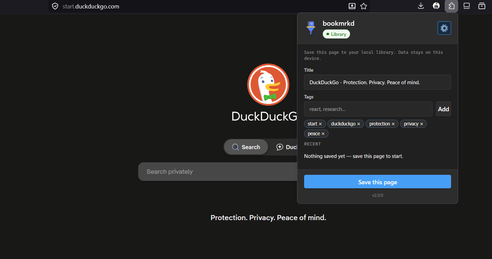
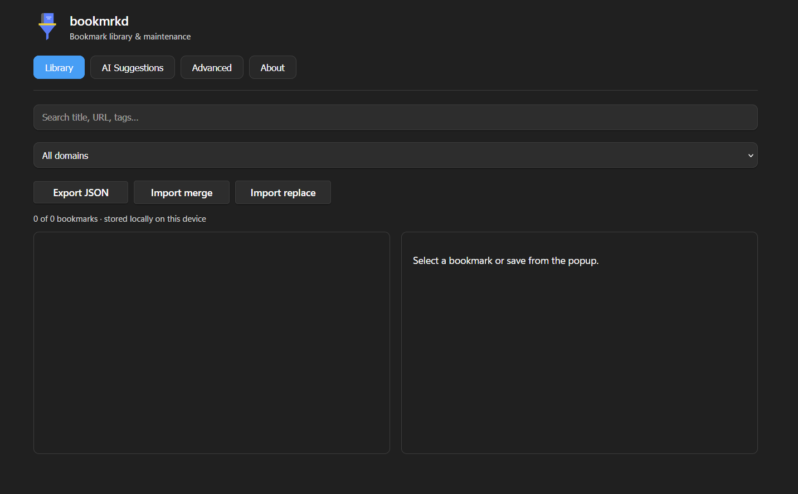
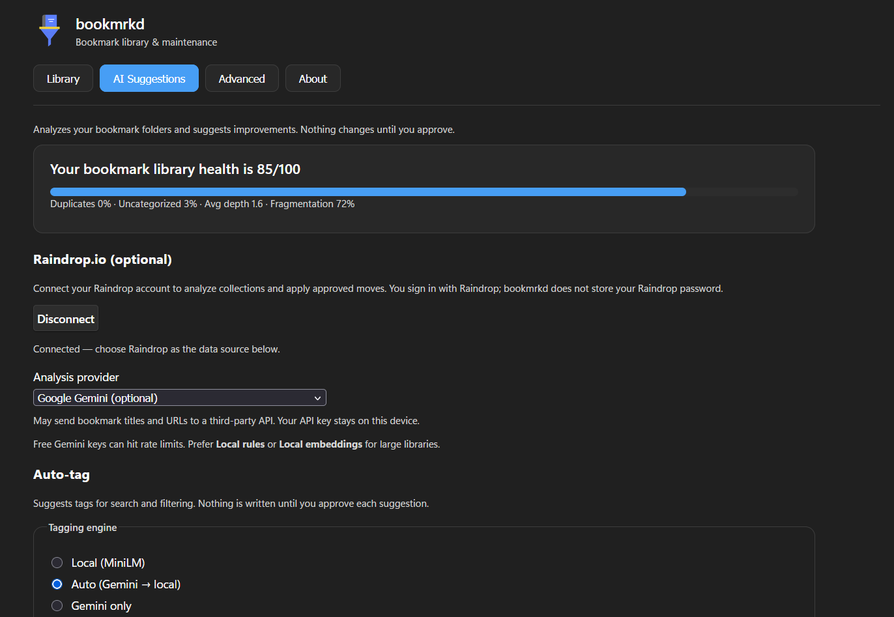
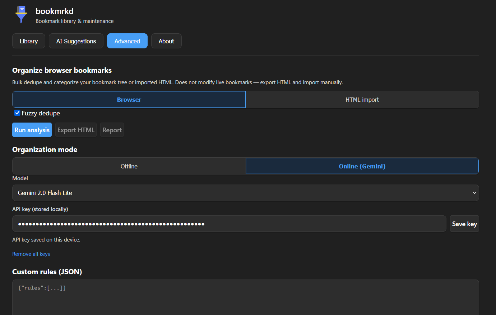

# bookmrkd

<p align="center">
  
</p>

<p align="center">
  <strong>AI-powered bookmark maintenance assistant</strong><br />
  Save, tag, search — local-first suggestions for your browser folders.
</p>

<p align="center">
  <a href="https://github.com/minhaj14d/bookmrkd/releases/latest">
    
  </a>
  &nbsp;
  <a href="https://github.com/minhaj14d/bookmrkd/releases/latest">
    
  </a>
</p>

<p align="center">
  <sub>
    Install from <a href="https://github.com/minhaj14d/bookmrkd/releases">GitHub Releases</a>
    (<code>*-firefox.zip</code> / <code>*-chromium.zip</code>).
    Firefox Add-ons (AMO) listing pending review.
  </sub>
</p>

<p align="center">
  <a href="https://github.com/minhaj14d/bookmrkd/blob/main/LICENSE"></a>
  <a href="https://github.com/minhaj14d/bookmrkd/releases"></a>
  
  
  
</p>

<p align="center">
  <strong>Minhajul Abedin</strong> · <a href="https://github.com/minhaj14d">github.com/minhaj14d</a>
</p>

---

## Screenshots

<p align="center">
  
  &nbsp;
  
</p>

<p align="center">
  
  &nbsp;
  
</p>

| | |
|---|---|
| **Popup** | Save the current tab with tags; data stays on your device |
| **Library** | Search, filter, export/import JSON |
| **AI Suggestions** | Folder health score; approve moves before anything changes |
| **Advanced** | Bulk dedupe, rules, HTML export; offline by default |

---

## Problem

Browser bookmarks are built for saving links, not for **finding** them later. Folders alone do not fix duplicate piles, stale “read later” tabs, or weak search. Cloud bookmark apps lock your library on their servers.

## Solution

**bookmrkd** is a Manifest V3 extension that helps you **maintain** bookmarks you already organized:

- Save the current tab with tags (popup or context menu)
- Search and filter by title, URL, tags, and domain
- **AI Suggestions** — analyze folders, get move/duplicate/cleanup ideas with confidence and reasoning; **nothing changes until you approve**
- Export/import your library as JSON
- **Advanced** — optional bulk dedupe/categorize + Netscape HTML export
- **No analytics, no telemetry, no data selling** — library data stays in IndexedDB on your device

```text
Popup (save + recents)
        ↓
IndexedDB library  ←→  Options (search / filter / export)
        ↓
AI Suggestions (Smart Collection Assistant)
        ↓
Advanced (organize browser bookmarks, optional Gemini)
```

## Features (v2.0.0)

| Area | What you get |
|------|----------------|
| **Library** | Save tab, tags, favicon, URL dedupe, recent list |
| **AI Suggestions** | Health score, move/duplicate/merge suggestions, local learning |
| **Providers** | Local rules (default), optional MiniLM, Gemini, or OpenAI |
| **Search** | Title, URL, tags; filter by tag and domain |
| **Storage** | IndexedDB (`bookmrkd_v1` library + `bookmrkd_v2` SCA) |
| **Backup** | Export/import JSON |
| **Advanced** | Dedupe, rules, fuzzy match, HTML export, report |
| **Firefox** | `dist-firefox/` build with Gecko ID for AMO |

## Install

### Firefox (recommended)

1. Download **`bookmrkd-v2.0.0-firefox.zip`** from [Releases](https://github.com/minhaj14d/bookmrkd/releases).
2. Extract the folder (must contain `manifest.json` at the root).
3. **Temporary:** `about:debugging` → **This Firefox** → **Load Temporary Add-on** → select `manifest.json`.
4. **After AMO approval:** install from [Firefox Add-ons](https://addons.mozilla.org/firefox/) (link will be updated here).

### Chromium (Chrome, Edge, Brave)

1. Download **`bookmrkd-v2.0.0-chromium.zip`** from [Releases](https://github.com/minhaj14d/bookmrkd/releases).
2. Extract and open **Extensions** → **Developer mode** → **Load unpacked** → select the extracted folder.

### Build from source

```bash
git clone https://github.com/minhaj14d/bookmrkd.git
cd bookmrkd/extension
npm ci
npm run build:all    # extension/dist + extension/dist-firefox
```

Load `extension/dist` (Chromium) or `extension/dist-firefox` (Firefox) as above.

## Privacy

- **No tracking** — no analytics SDKs, no external logging
- **Local-first** — IndexedDB on your device; works offline for library features
- **Optional AI** — Gemini/OpenAI only when you add your own API keys
- Full policy: [docs/PRIVACY.md](docs/PRIVACY.md)

## Development

```bash
cd extension
npm run dev            # Vite watch
npm run build:all      # dist/ + dist-firefox/
npm run lint:all
npm run typecheck
npm run pack           # → release/*.zip
```

Version source of truth: [`VERSION`](VERSION) → `src/manifest.json`, `package.json`, `src/lib/version.ts`.

## Repository layout

```
bookmrkd/
├── extension/          # MV3 source + builds (dist/ gitignored)
├── docs/               # PRIVACY.md, AMO listing copy
├── screenshots/        # README & store screenshots
├── VERSION
├── LICENSE             # GPL-3.0
└── README.md
```

## Roadmap

- **Firefox Add-ons** — public listing on AMO
- **v2.1** — IndexedDB library tag-cluster suggestions
- **Chrome Web Store** — optional (when ready)

## License

Copyright © 2026 [Minhajul Abedin](https://github.com/minhaj14d). Licensed under [GPL-3.0](LICENSE).
